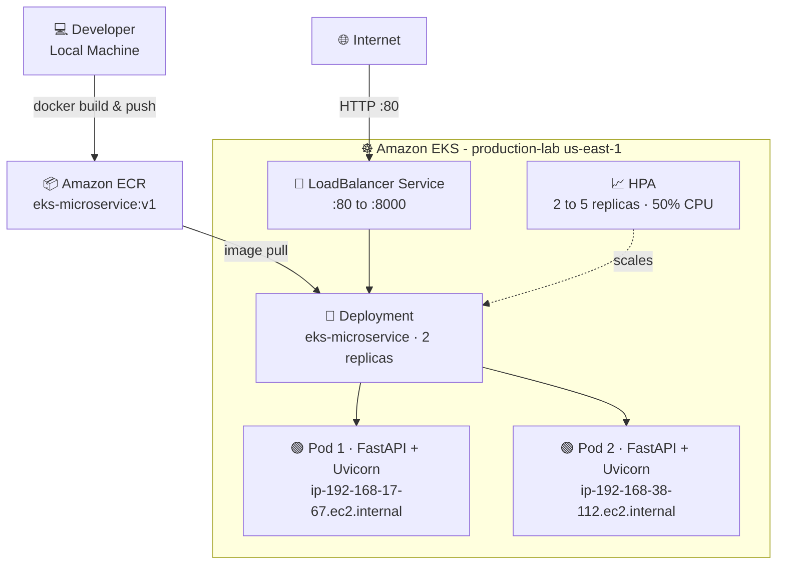
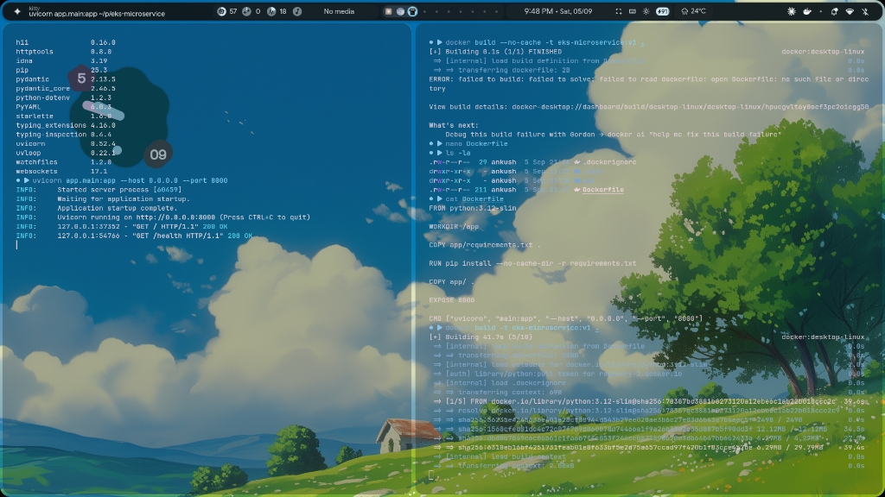
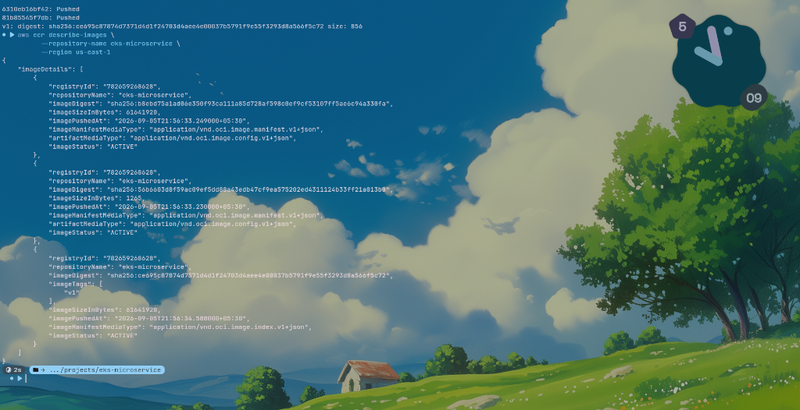
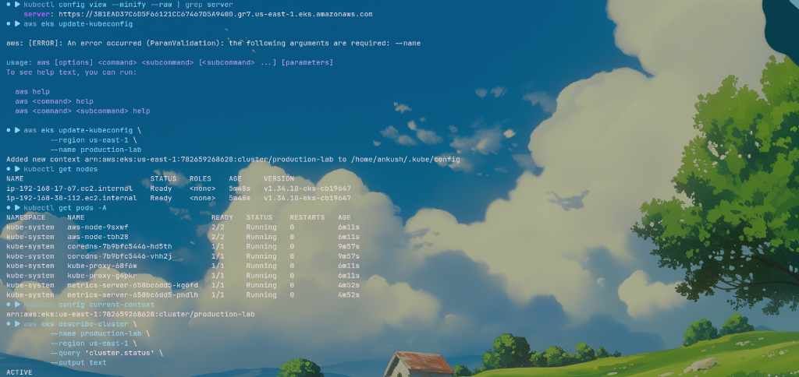
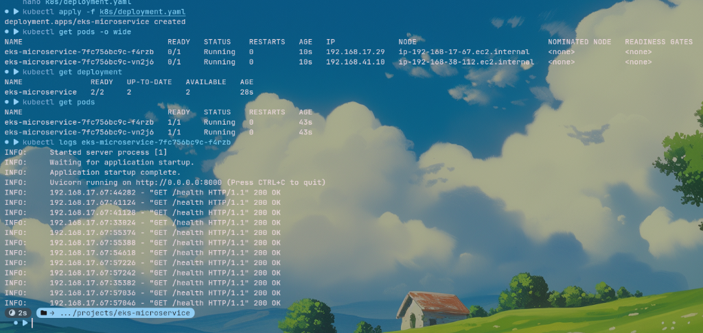
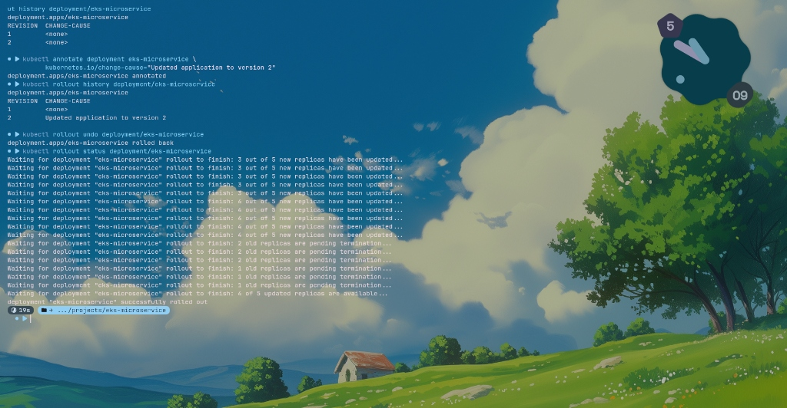

<div align="center">

# 🚀 EKS Production Microservice

<p align="center">
  <b>A production-grade FastAPI microservice containerised with Docker, pushed to Amazon ECR, and deployed on Amazon EKS with Horizontal Pod Autoscaling.</b>
</p>

<p align="center">
  
  
  
  
  
  
</p>

</div>

---

## 📋 Table of Contents

- [Overview](#-overview)
- [Architecture](#-architecture)
- [Tech Stack](#-tech-stack)
- [Project Structure](#-project-structure)
- [Prerequisites](#-prerequisites)
- [Quick Start — Local Development](#-quick-start--local-development)
- [Docker — Build & Run](#-docker--build--run)
- [Amazon ECR — Push Image](#-amazon-ecr--push-image)
- [EKS Cluster Setup](#-eks-cluster-setup)
- [Kubernetes Deployment](#-kubernetes-deployment)
- [API Endpoints](#-api-endpoints)
- [Rolling Updates & Rollback](#-rolling-updates--rollback)
- [Horizontal Pod Autoscaling](#-horizontal-pod-autoscaling)
- [Screenshots](#-screenshots)
- [License](#-license)

---

## 🌟 Overview

This project demonstrates a **complete cloud-native deployment pipeline** for a Python microservice on AWS. It covers every step from local development through containerisation, ECR image registry, EKS cluster provisioning, and live production traffic management.

**Key highlights:**
- ⚡ Lightweight FastAPI service with health, root, and API endpoints
- 🐳 Optimised multi-stage-friendly Dockerfile based on Python 3.12-slim
- 📦 Image stored in Amazon ECR (private registry)
- ☸️ Deployed on Amazon EKS with managed node groups
- 📈 Auto-scaled by HPA from 2 → 5 replicas at 50% CPU
- 🔄 Zero-downtime rolling updates with one-command rollback

---

## 🏗 Architecture



---

## 🛠 Tech Stack

| Layer | Technology | Details |
|-------|-----------|---------|
| **Language** | Python 3.12 | `python:3.12-slim` base image |
| **Framework** | FastAPI | Async HTTP microframework |
| **Server** | Uvicorn | ASGI server, port 8000 |
| **Container** | Docker | Optimised slim image |
| **Registry** | Amazon ECR | Private image registry, `us-east-1` |
| **Orchestration** | Amazon EKS | Managed Kubernetes 1.34 |
| **Cluster Tool** | eksctl | Declarative cluster via `cluster.yaml` |
| **Autoscaling** | Kubernetes HPA | v2, CPU-based, 2–5 replicas |
| **Load Balancing** | AWS LoadBalancer Service | External traffic entry point |

---

## 📁 Project Structure

```
eks-production-microservice/
├── app/
│   ├── main.py               # FastAPI application (3 endpoints)
│   └── requirements.txt      # Python dependencies
├── k8s/
│   ├── deployment.yaml       # Kubernetes Deployment (2 replicas, probes, limits)
│   ├── service.yaml          # LoadBalancer Service (port 80 → 8000)
│   └── hpa.yaml              # HorizontalPodAutoscaler (2 → 5, 50% CPU)
├── docs/
│   └── images/               # Screenshots used in this README
├── cluster.yaml              # eksctl ClusterConfig (production-lab, us-east-1)
├── Dockerfile                # Container build instructions
├── .dockerignore             # Files excluded from Docker context
└── README.md                 # This file
```

---

## ✅ Prerequisites

Make sure the following tools are installed and configured:

```bash
# Check versions
python --version          # >= 3.12
docker --version          # >= 20.10
kubectl version --client  # >= 1.27
eksctl version            # >= 0.190
aws --version             # >= 2.x
```

AWS credentials must be configured:
```bash
aws configure
# or export AWS_PROFILE=your-profile
```

---

## ⚡ Quick Start — Local Development

```bash
# 1. Clone the repository
git clone https://github.com/ankushkhakale/eks-production-microservice.git
cd eks-production-microservice

# 2. Create a virtual environment and install dependencies
python -m venv .venv
source .venv/bin/activate
pip install -r app/requirements.txt

# 3. Run the application
uvicorn app.main:app --host 0.0.0.0 --port 8000 --reload

# 4. Test locally
curl http://localhost:8000/health
# → {"status":"healthy"}
```

---

## 🐳 Docker — Build & Run

```bash
# Build the image
docker build --no-cache -t eks-microservice:v1 .

# Run locally
docker run -p 8000:8000 eks-microservice:v1

# Verify
curl http://localhost:8000/
curl http://localhost:8000/health
curl http://localhost:8000/api
```

> 📸 **Screenshot — Local Docker build and Uvicorn startup:**



---

## 📦 Amazon ECR — Push Image

```bash
# Variables
AWS_ACCOUNT_ID=782659268628
REGION=us-east-1
REPO_NAME=eks-microservice

# Authenticate Docker to ECR
aws ecr get-login-password --region $REGION \
  | docker login --username AWS \
    --password-stdin $AWS_ACCOUNT_ID.dkr.ecr.$REGION.amazonaws.com

# Tag the image
docker tag eks-microservice:v1 \
  $AWS_ACCOUNT_ID.dkr.ecr.$REGION.amazonaws.com/$REPO_NAME:v1

# Push to ECR
docker push \
  $AWS_ACCOUNT_ID.dkr.ecr.$REGION.amazonaws.com/$REPO_NAME:v1

# Verify image is in ECR
aws ecr describe-images \
  --repository-name $REPO_NAME \
  --region $REGION
```

> 📸 **Screenshot — ECR image push and describe-images output:**



---

## ☸️ EKS Cluster Setup

The cluster is defined declaratively in [`cluster.yaml`](cluster.yaml):

```yaml
apiVersion: eksctl.io/v1alpha5
kind: ClusterConfig

metadata:
  name: production-lab
  region: us-east-1

managedNodeGroups:
  - name: worker-nodes
    instanceType: t3.small
    minSize: 2
    desiredCapacity: 2
    maxSize: 3
```

```bash
# Create the cluster (takes ~15 minutes)
eksctl create cluster -f cluster.yaml

# Configure kubectl context
aws eks update-kubeconfig \
  --region us-east-1 \
  --name production-lab

# Verify nodes are Ready
kubectl get nodes
```

> 📸 **Screenshot — EKS cluster context and node listing:**



---

## 🚀 Kubernetes Deployment

Apply all manifests with a single command:

```bash
kubectl apply -f k8s/deployment.yaml
kubectl apply -f k8s/service.yaml
kubectl apply -f k8s/hpa.yaml
```

Or apply the whole directory:
```bash
kubectl apply -f k8s/
```

**Verify everything is running:**
```bash
# Watch pods come up
kubectl get pods -o wide

# Check deployment
kubectl get deployment eks-microservice

# View service (get external LoadBalancer URL)
kubectl get service eks-microservice

# Tail pod logs
kubectl logs -f deployment/eks-microservice
```

> 📸 **Screenshot — Pods running and health check logs streaming:**



### Deployment Spec Summary

| Setting | Value |
|---------|-------|
| Image | `782659268628.dkr.ecr.us-east-1.amazonaws.com/eks-microservice:v1` |
| Replicas | 2 (initial) |
| CPU Request | 100m |
| CPU Limit | 500m |
| Memory Request | 128Mi |
| Memory Limit | 256Mi |
| Readiness Probe | `GET /health` every 10s after 5s delay |
| Liveness Probe | `GET /health` every 20s after 10s delay |

---

## 🌐 API Endpoints

Once the LoadBalancer is provisioned, get the external URL:

```bash
kubectl get svc eks-microservice -o jsonpath='{.status.loadBalancer.ingress[0].hostname}'
```

| Method | Endpoint | Description | Response |
|--------|----------|-------------|----------|
| `GET` | `/` | Service info | `{"service":"eks-microservice","message":"Hello from Amazon EKS - version 2","hostname":"<pod>","timestamp":"<utc>"}` |
| `GET` | `/health` | Health check (used by K8s probes) | `{"status":"healthy"}` |
| `GET` | `/api` | Platform info | `{"message":"Production-style microservice is running","platform":"Amazon EKS"}` |

```bash
# Example requests (replace <LB_URL> with your LoadBalancer hostname)
LB_URL=$(kubectl get svc eks-microservice -o jsonpath='{.status.loadBalancer.ingress[0].hostname}')

curl http://$LB_URL/
curl http://$LB_URL/health
curl http://$LB_URL/api
```

---

## 🔄 Rolling Updates & Rollback

Update the image to a new version and track the rollout:

```bash
# Update image to v2
kubectl set image deployment/eks-microservice \
  microservice=782659268628.dkr.ecr.us-east-1.amazonaws.com/eks-microservice:v2

# Annotate for history tracking
kubectl annotate deployment eks-microservice \
  kubernetes.io/change-cause="Updated application to version 2"

# Monitor rollout progress
kubectl rollout status deployment/eks-microservice

# View rollout history
kubectl rollout history deployment/eks-microservice
```

**Rollback to previous version (instant):**
```bash
# Roll back to the previous revision
kubectl rollout undo deployment/eks-microservice

# Or roll back to a specific revision
kubectl rollout undo deployment/eks-microservice --to-revision=1
```

> 📸 **Screenshot — Rollout history, undo, and rollback status:**



---

## 📈 Horizontal Pod Autoscaling

The HPA automatically scales pods from **2 to 5 replicas** when CPU utilisation exceeds **50%**.

```yaml
# k8s/hpa.yaml
spec:
  scaleTargetRef:
    apiVersion: apps/v1
    kind: Deployment
    name: eks-microservice
  minReplicas: 2
  maxReplicas: 5
  metrics:
    - type: Resource
      resource:
        name: cpu
        target:
          type: Utilization
          averageUtilization: 50
```

```bash
# Watch HPA in action
kubectl get hpa eks-microservice-hpa -w

# Simulate load to trigger scale-out
kubectl run load-generator --image=busybox --restart=Never -- \
  /bin/sh -c "while true; do wget -q -O- http://eks-microservice/; done"
```

---

## 🧹 Clean Up

```bash
# Remove Kubernetes resources
kubectl delete -f k8s/

# Delete the EKS cluster (and all node groups)
eksctl delete cluster --name production-lab --region us-east-1

# (Optional) Delete ECR repository
aws ecr delete-repository \
  --repository-name eks-microservice \
  --region us-east-1 \
  --force
```

---

## 📄 License

This project is open source and available under the [MIT License](LICENSE).

---

<div align="center">
  <p>Built with ❤️ by <a href="https://github.com/ankushkhakale">Ankush Khakale</a></p>
  <p>
    <a href="https://github.com/ankushkhakale/eks-production-microservice/stargazers">⭐ Star this repo</a>
    ·
    <a href="https://github.com/ankushkhakale/eks-production-microservice/issues">🐛 Report a Bug</a>
  </p>
</div>
